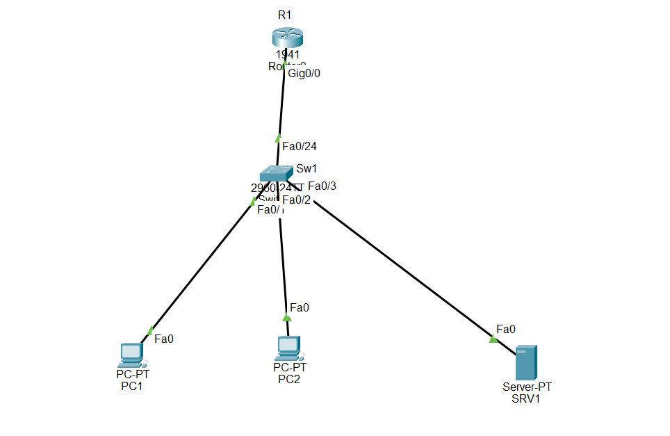

# DHCP & DNS Lab

## Objective

Designed and configured a small network using Cisco Packet Tracer, implementing DHCP for automatic IP address assignment and DNS for hostname resolution.

## Network Components

- 2 PCs
- 1 Cisco 2960 switch
- 1 Cisco 1941 router
- 1 Server

## Networking Concepts Demonstrated

- IPv4 addressing
- DHCP
- DNS
- Static IP addressing
- Default gateway configuration
- Ethernet switching
- Network connectivity testing
- DNS name resolution

## IP Addressing

### Network

- **Network:** `192.168.50.0/24`
- **Subnet Mask:** `255.255.255.0`
- **Default Gateway:** `192.168.50.1`

### Devices

- **R1 G0/0:** `192.168.50.1` — Static
- **SW1 VLAN 1:** `192.168.50.2` — Static
- **SRV1:** `192.168.50.20` — Static
- **PC1:** `192.168.50.100` — DHCP
- **PC2:** `192.168.50.101` — DHCP

## DHCP Configuration

DHCP was configured on the server to automatically assign IP addresses and network settings to client PCs.

### DHCP Settings

- **DHCP Service:** ON
- **DHCP Pool:** `serverPool`
- **Default Gateway:** `192.168.50.1`
- **DNS Server:** `192.168.50.20`
- **Starting IP Address:** `192.168.50.100`
- **Subnet Mask:** `255.255.255.0`
- **Maximum Users:** `50`

### DHCP Results

The client PCs successfully received their network configuration automatically through DHCP.

- **PC1:** `192.168.50.100`
- **PC2:** `192.168.50.101`
- **Default Gateway:** `192.168.50.1`
- **DNS Server:** `192.168.50.20`

## DNS Configuration

DNS was configured on SRV1 to provide hostname resolution.

### DNS Settings

- **DNS Service:** ON
- **Hostname:** `server.enterprise.local`
- **IP Address:** `192.168.50.20`

The hostname successfully resolved to the server's IP address from both PCs.

## Router Configuration

R1 was configured as the default gateway for the LAN.

Configuration:

    hostname R1
    enable secret cisco123

    interface g0/0
     ip address 192.168.50.1 255.255.255.0
     no shutdown

## Switch Configuration

SW1 was configured with a management IP address and default gateway.

Configuration:

    hostname SW1

    interface vlan 1
     ip address 192.168.50.2 255.255.255.0
     no shutdown

    ip default-gateway 192.168.50.1

## Network Topology

## Technologies Used

- Cisco Packet Tracer
- Cisco IOS CLI
- Cisco 1941 Router
- Cisco 2960 Switch
- Server-based DHCP
- Server-based DNS
- IPv4
- Ethernet

## Connectivity Tests

The following connectivity and DNS tests were successfully completed:

- **PC1 → PC2:** Successful
- **PC2 → PC1:** Successful
- **PC1 → R1 (`192.168.50.1`):** Successful
- **PC2 → R1 (`192.168.50.1`):** Successful
- **PC1 → `server.enterprise.local`:** Successful
- **PC2 → `server.enterprise.local`:** Successful
- **PC1 `nslookup`:** Successful
- **PC2 `nslookup`:** Successful

### DNS Resolution Result

    server.enterprise.local
    → 192.168.50.20

## Troubleshooting

### DHCP Configuration Issue

Initially, the default DHCP pool provided incorrect network settings to the client.

The client received an IP address but had:

- **Default Gateway:** `0.0.0.0`
- **DNS Server:** `0.0.0.0`

The DHCP pool was then configured with the correct gateway, DNS server, starting IP address, subnet mask, and maximum number of users.

After the correction, the PCs successfully received the expected DHCP configuration.

### Router Configuration Recovery

The router interface configuration was initially lost after a reboot because the running configuration had not been saved.

The interface was reconfigured and the configuration was saved using:

    copy running-config startup-config

### DNS Verification

DNS resolution was verified using:

    nslookup server.enterprise.local

The hostname successfully resolved to:

    192.168.50.20

## Conclusion

This project demonstrates the implementation of a basic enterprise LAN using DHCP and DNS services.

DHCP provides automatic IP address configuration for client devices, while DNS allows clients to access the server using a hostname instead of an IP address.

The project also demonstrates basic Cisco router and switch configuration, IPv4 addressing, default gateway configuration, network connectivity testing, DNS resolution, and troubleshooting.
